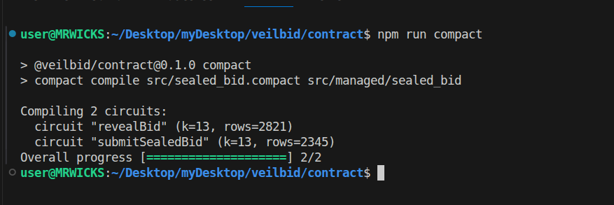
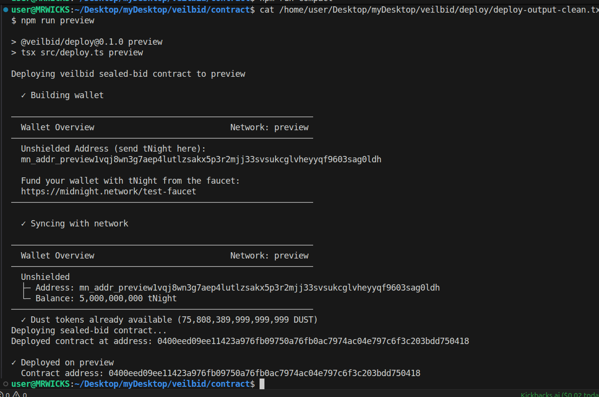

# veilbid

A sealed-bid commitment contract for [Midnight](https://midnight.network), with a frontend that connects Lace and
calls it live. Built across the **New Moon (Level 1)** and **First Thread of Light (Level 2)** cycles of the
monthly Midnight builder challenge.

**Live demo:** [veilbid-web.vercel.app](https://veilbid-web.vercel.app/)
**Demo video:** [youtu.be/3MLqEKpK8DI](https://youtu.be/3MLqEKpK8DI)
**Deployed on Preview:** `00a828a2f34e3132db47a8e8c27436eed7e89e5edd359cddd11ea9bdf5a74a2a`
(verifiable via the Preview indexer's `contractAction` query, on a Midnight Preview block explorer, or directly in
the app's own "Public Ledger" panel, which reads it with no wallet connected at all)

> Level 2 targets **Preview**, not Preprod — the same network as the Level 1 deployment above, so the frontend
> joins an already-verified contract instead of redeploying.

> **Level 3 update:** the contract was redeployed at this address after redesigning it to support multiple
> concurrent sealed bidders (see "Multi-bidder auction" below) — the Level 1/2 address above is superseded.

## Level 1 — contract and deploy

### Initial product idea

Sealed-bid auctions are common in procurement, real estate, and collectibles, but running one honestly today means
trusting a middleman not to leak or front-run bids before the auction closes. veilbid explores what a sealed-bid
auction looks like when the chain itself enforces the seal: a bidder commits to an amount with a private witness,
and only a cryptographic commitment (not the amount, not their identity) touches the public ledger. When the
auction closes, bidders reveal — and the contract publicly discloses a bid's amount and bidder identity only if it
turns out to be the new highest, via an explicit `disclose()` call. Losing bids never have their amounts exposed at
all. The natural next step beyond this Level 1 scope is multi-bidder support (a `Map`-keyed ledger of commitments
instead of a single slot) so a real auction with many simultaneous participants can run end-to-end.

### Public state vs. private witness

Compact contracts draw a hard line between what is written to the public ledger (visible to anyone, forever) and
what stays as a private witness (known only to whoever supplies it, and never transmitted unless a circuit
explicitly discloses it). This contract uses both deliberately:

**Public ledger state** (`contract/src/sealed_bid.compact`):
- `sealedCommitments: Map<Bytes<32>, Bytes<32>>` — a hash commitment per sealed bid, keyed by that bid's own random
  slot. Anyone can see how many bids exist and their commitment hashes; nobody can recover an amount or bidder
  from any of them.
- `highestBid: Uint<64>` and `winnerId: Bytes<32>` — the amount and identity of the current highest bidder, but
  **only after** a winning reveal. They stay at their zero defaults for every bid that never becomes the winner.
- `bidsSubmitted: Counter` — a public count of how many bids have ever been sealed. Reveals activity, not content.

**Private witnesses** (`contract/src/witnesses.ts`):
- `bidAmount()`, `bidNonce()`, `bidderId()` — supplied locally by the bidder's own code. These values never appear
  on the ledger on their own.
- `slotKey()` — a random per-bid handle used only to route a bid to its own Map slot (see "Multi-bidder auction"
  below). It carries no identity meaning and never appears inside the commitment hash.

The two circuits show the boundary in action:
- `submitSealedBid()` computes `persistentCommit(bidAmount(), bidNonce())` and inserts only that hash into
  `sealedCommitments`, under this bid's own `slotKey()`. The amount itself never leaves the caller's machine at
  this stage.
- `revealBid()` recomputes the same commitment and asserts it matches that slot's stored value — proving the
  caller knew the value all along without ever having exposed it. Only if the revealed amount beats the current
  `highestBid` does the circuit call `disclose(bidAmount())` and `disclose(bidderId())` to deliberately publish
  those values. The Compact compiler enforces this: writing a witness-derived value (or even branching on a
  comparison involving one) to the ledger without an explicit `disclose()` is a compile error, not just a
  convention.

### Multi-bidder auction (Level 3)

The original single-`Bytes<32>` `sealedCommitment` field could only hold one active sealed bid at a time — a
second `submitSealedBid()` call would silently overwrite the first. `sealedCommitments` is now a
`Map<Bytes<32>, Bytes<32>>`, so many bidders can hold independent sealed slots at once.

The Map needs a public key to route each bid to its own slot, which raised a real design question: keying by
`bidderId` would disclose *who* submitted a bid at submit time, a privacy regression versus the original design
(identity was only ever revealed if that bid later won). Keying by `bidNonce` would be worse — it's the blinding
factor inside the commitment hash, so publishing it would let anyone brute-force a bidder's (low-entropy) amount
by recomputing `persistentCommit(candidate, disclosed_nonce)` against the stored hash. `slotKey()` is a third,
independent random value used solely as a Map handle: disclosing it leaks nothing beyond "a sealed commitment
exists here," exactly matching what the original single-slot design already leaked.

## Level 2 — frontend and Lace

`web/` is a Next.js app that connects the Lace wallet (the Midnight DApp Connector API v4, `window.midnight.mnLace`)
and calls the deployed contract's circuits directly from the browser — no backend in between.

**What it demonstrates:**
- **Wallet connect / disconnect** — polls for the Lace extension, connects on Preview, and validates the wallet
  actually landed on that network before proceeding. "Disconnect" drops the app's reference to the connector API,
  since the protocol itself has no disconnect call.
- **A circuit called from the frontend** — `submitSealedBid()` and `revealBid()` run through the same
  `midnight-js-contracts` machinery as the Level 1 Node deploy script, just wired to Lace instead of a headless
  wallet: proving still happens on a local proof server (Lace does not implement in-browser proving), balancing and
  submission go through the wallet.
- **An observable privacy behavior** — see below.

**Observable privacy behavior — "proven, not shown":** the app's Privacy Ledger panel shows two pages of the same
book, live: your private page (the amount, nonce, and bidder id you typed — never sent anywhere as-is) and the
chain's public page (read straight from the indexer). Sealing a bid writes only a commitment hash to the public
page; the amount stays sealed there — visibly, as a redacted placeholder — until a reveal. If the revealed bid
becomes the new highest, the amount and bidder id visibly move to the public page with a "disclosed on-chain"
badge; if it doesn't, the UI states plainly that the amount was never disclosed, and nothing moves. This isn't a UI
claim layered on top — it's a direct reflection of the contract's real `disclose()` calls, readable by anyone via
the same Public Ledger panel with no wallet connected.

**A note on proving:** Lace does not implement in-browser proving (`getProvingProvider()` is unimplemented in the
current release), so it requires a local proof server the same way the Level 1 deploy script does. This means:
anyone can open the live demo link and see the Public Ledger panel update in real time with zero setup, but
*submitting* a real sealed bid requires Lace installed and a local proof server running (step 1 below) — this is
standard for Midnight dApps today, not a limitation specific to this app.

### Run the frontend locally

```bash
# 1. Proof server (if not already running from the Level 1 setup)
docker run -d --name midnight-proof-server -p 6300:6300 midnightntwrk/proof-server:8.1.0

# 2. Install the Lace browser extension, create/import a wallet, set it to Preview,
#    and point its proof server setting at http://localhost:6300

# 3. From the repo root
npm install
cd web
npm run dev
```

Open `http://localhost:3000`. The Public Ledger panel works immediately (it reads the indexer directly). Click
**Connect Lace** to authorize the connection, enter a bid, and **Seal this bid** — Lace will prompt to sign/submit
the transaction. Once sealed, **Reveal this bid** becomes available.

### Demo video

[youtu.be/3MLqEKpK8DI](https://youtu.be/3MLqEKpK8DI) — connecting Lace, sealing a bid, and revealing it live on Preview.

### Setup — contract, tests, and deploy

Prerequisites: Node.js 22+, Docker, and the [Compact toolchain](https://docs.midnight.network/getting-started/installation).

```bash
git clone <this-repo-url>
cd veilbid
npm install
```

#### 1. Start the proof server

```bash
docker run -d --name midnight-proof-server -p 6300:6300 midnightntwrk/proof-server:8.1.0
```

#### 2. Compile the contract

```bash
cd contract
npm run compact
```

This runs `compact compile src/sealed_bid.compact src/managed/sealed_bid`, producing the `managed/` directory
(compiled TypeScript contract wrapper, zkir circuits, and proving/verifying keys for both circuits).

#### 3. Run the tests

```bash
npm test
```

Six tests cover: empty initial state, a commit that doesn't disclose the amount, disclosure on a winning reveal, a
higher bid overtaking the previous winner, a lower bid being correctly ignored, and a mismatched reveal being
rejected by the contract.

#### 4. Deploy to Preview or Preprod

```bash
cd ../deploy
npm run preview   # or: npm run preprod
```

On first run this generates a fresh wallet seed (saved to a gitignored `deploy/.env`), prints the wallet's
unshielded address, and waits — fund that address from the network's faucet
(`https://midnight.network/test-faucet` for Preview, `https://faucet.preprod.midnight.network/` for Preprod). Once
funded, the script registers the NIGHT for DUST generation and deploys automatically, printing the contract
address.

## Screenshots

**Successful compile** — both circuits compiled (`revealBid`, `submitSealedBid`):



**Deployed to Preview** — funded wallet and the resulting contract address:



## Project structure

```
contract/
  src/sealed_bid.compact   — the Compact contract
  src/witnesses.ts         — private witness implementations
  src/managed/             — compiled circuits, keys, zkir (generated by `compact compile`)
  src/test/                — Vitest suite using the compact-runtime simulator
deploy/
  src/config.ts            — Preview/Preprod/local network endpoints
  src/wallet.ts            — wallet construction, sync, and provider wiring
  src/deploy.ts            — one-shot deploy entrypoint
web/
  src/lib/wallet.ts        — Lace discovery, connect
  src/lib/providers.ts     — browser midnight-js providers (proving via Lace's local proof server)
  src/lib/contract.ts      — joins the deployed contract (findDeployedContract)
  src/lib/ledgerReader.ts  — wallet-free public ledger reads, straight from the indexer
  src/contexts/            — WalletContext (connect/disconnect) and ContractContext (submit/reveal)
  src/components/          — BidPanel, PublicLedgerPanel, PrivacyLedger, SealStamp, WalletConnectButton
```
